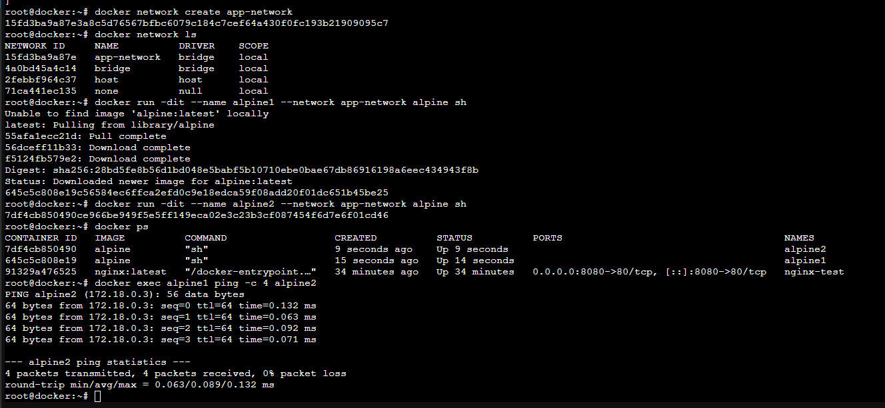

# Réseau Docker

## Objectif

Créer un réseau Docker dédié au projet et vérifier que deux conteneurs peuvent communiquer entre eux.

## Commandes utilisées

```bash
docker network ls
docker network inspect bridge
docker network create app-network
docker network ls
docker run -dit --name alpine1 --network app-network alpine sh
docker run -dit --name alpine2 --network app-network alpine sh
docker ps
docker exec alpine1 ping -c 4 alpine2

## Capture d'écran

La capture ci-dessous présente les différentes étapes réalisées :

- Affichage des réseaux Docker existants (`docker network ls`)
- Inspection du réseau `bridge`
- Création du réseau `app-network`
- Création des conteneurs `alpine1` et `alpine2`
- Vérification des conteneurs (`docker ps`)
- Test de communication entre les conteneurs avec `ping`




